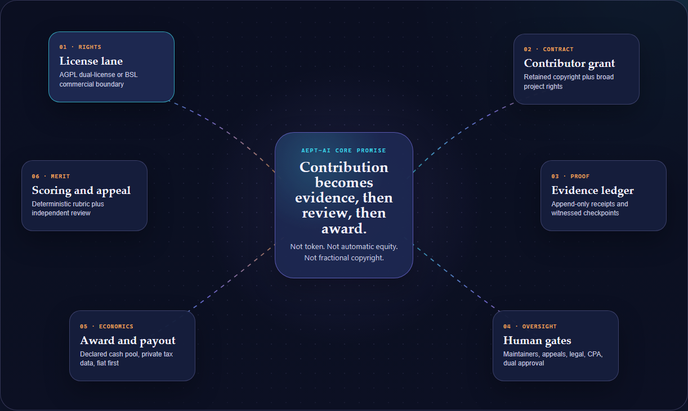

# AEPT-AI Contributor Commons

An interactive decision architecture for public-code licensing, contributor
compensation, cryptographic evidence, professional oversight, and enterprise
monetization.

## Current status

This repository is a public research and architecture artifact. It does not
activate a contributor compensation program, offer tokens or securities, or
provide legal, tax, accounting, or investment advice.

Public visibility is not a software license grant. No open-source or
source-available license has been selected for this repository yet. All rights
remain reserved unless and until an explicit license is added.

## View the project

Open [`index.html`](./index.html) directly, or visit the production deployment
linked in this repository's GitHub metadata.

## Documentation

- [Full blueprint](./docs/BLUEPRINT.md)
- [Verification record](./docs/VERIFICATION.md)

## Core decision

- If true OSI open source leads, evaluate AGPL-3.0 plus commercial dual
  licensing and a separate contributor compensation agreement.
- If mandatory enterprise payment leads, evaluate BSL 1.1 with a narrow
  Additional Use Grant and later open-source conversion.
- Do not treat Apache-2.0 as a contributor revenue-sharing mechanism.

Any production implementation remains gated on open-source, corporate,
securities, employment, tax, privacy, and professional-practice review.

## Technical shape

The deployed artifact is a dependency-free static HTML application with
responsive CSS and client-side interaction. It requires no build step, runtime
secrets, database, or third-party JavaScript.

## Verification

The artifact passed headless Chromium checks at desktop, tablet, and mobile
widths with zero horizontal overflow and zero console errors. See
[`docs/VERIFICATION.md`](./docs/VERIFICATION.md) for the recorded measurements
and artifact hashes.
